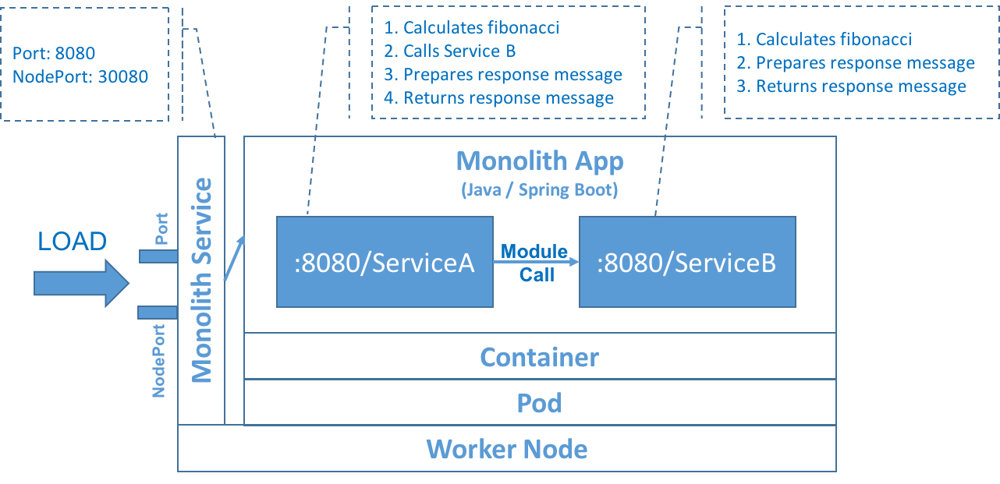
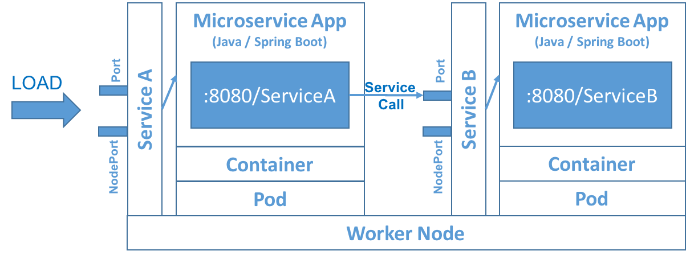

# Microservices Latency Analysis

Microservice is an architectural style to develop autonomous and distributed services and it's motto clearly defines that each service does one thing and does it well. Microservices expose their well-defined services over lightweight protocols (like REST, Message Queue), communicate with each other over those protocols and they are very resilient for changing loads and failures. Microservices are often confused with SOA where SOA's main focus is integrations and to provide coarse grained services on the other hand Microservices' focus is to develop autonomous and distributed applications and providing fine grained services.

With this code you can build a **simulation environment** to investigate the effect of latency after splitting the monolith application into Microservices. The sample application com.mycompany.services was developed with Spring Cloud and can be deployed to Kubernetes as a monolith application or microservices. The application exposes 2 services ServiceA and ServiceB using the same interface (input: com.mycompany.data.ServiceRequest, output: com.mycompany.data.ServiceResponse). You can tune the services' CPU consuption and response message size using ServiceConfig in the request message. To simulate the CPU consumption, both services calculate a fibonacci based on input parameter (ServiceConfig) and ServiceA additionally calls ServiceB after the calculation. Both services return a response message and the size of the message can be set in the input parameter.

The following diagram shows how monolith application works on Kubernetes. You can use **monolith-deployment.yaml** to generate this structure. Load can be generated externally (out of Kubenetes system) or internally. If load is generated externally then the target endpoint should be constructed using Worker Node's public IP and Service's NodePort. If the load is generated internally then the target endpoint should be constructed using Service's name (e.g. "monolith-service")s and Service's Port.



The following diagram shows how Microservices applications work on Kubernetes. You can use **microserviceA-deployment.yaml** and **microserviceB-deployment.yaml** to generate this structure.



The following shows sample ServiceRequest:
```xml
{
  "reqId": "request1",
  "serviceConfig": {
    "ServiceA": {
      "fibonacci": 34,
      "responseSize": 5
    },
    "ServiceB": {
      "fibonacci": 36,
      "responseSize": 10
    }
  }
}
```

The following shows sample ServiceResponse:
```xml
{
  "reqId": "request1",
  "items": [
    {
      "value": "Time: 1512657114556"
    },
    {
      "value": "855bfbac-60fb-4407-aeb1-bf668a182135"
    },
    {
      "value": "855bfbac-60fb-4407-aeb1-bf668a182135"
    },
    {
      "value": "855bfbac-60fb-4407-aeb1-bf668a182135"
    },
    {
      "value": "855bfbac-60fb-4407-aeb1-bf668a182135"
    }
  ]
}
```

## Prerequisites for Setup

Create a Kubernetes cluster with either [Minikube](https://kubernetes.io/docs/getting-started-guides/minikube) for local testing, or with [IBM Bluemix Container Service](https://github.com/IBM/container-journey-template) to deploy in cloud.

You will need to create your Kubernetes cluster first and make sure it is fully deployed in your Bluemix account.

Please follow the steps below to install the sample application into your Bluemix Kubernetes cluster and generate load.

## Steps
1. [Prepare Bluemix Kubernetes cluster](#1-prepare-bluemix-kubernetes-cluster)  
2. [Create the Docker Image](#2-create-the-docker-image)  
2.1 [Build Project using Maven](#21-build-project-using-maven)  
2.2 [Build and Push Docker Images](#22-build-docker-image-for-the-application)
3. [Deploy the Application](#3-deploy-the-application)
3.1 [Deploy the Application as Monolith](#31-deploy-the-application-as-monolith)
3.2 [Deploy the Application as Microservices](#32-deploy-the-application-as-microservices)
4. [Generate load](#4-generate-load)

# 1. Prepare Bluemix Kubernetes cluster
Follow the instructions in [Getting Started](https://console.bluemix.net/containers-kubernetes/home/registryGettingStarted) to setup required tools and Bluemix Kubernetes cluster.

# 2. Create the Docker Image

## 2.1 Build project using Maven
First build the java project with Maven and then build the Docker image using the provided **Dockerfile** in the project folder.

```bash
Go to com.mycompany.services
$ mvn package
```

## 2.2 Build Docker image for the application
Docker image can be pushed into the Bluemix Container Registry or DockerHub. The example below builds the docker image to be put into the Bluemix Container Registry, please replace the <namespace> with the name of your namespace.

```bash
$ docker build -t registry.eu-gb.bluemix.net/<namespace>/com.mycompany.services .
$ docker push registry.eu-gb.bluemix.net/<namespace>/com.mycompany.services
```

# 3. Deploy the Application
The application can be deployed as monolith or microservices with the use of JVM parameter spring active profile.

## 3.1 Deploy the Application as Monolith
Default spring profile works as monolith application. In order to make the application work as monolith application, please run it with no spring active profile parameter. The following yaml file takes care of this.

```bash
$ kubectl create -f monolith-deployment.yaml
```

## 3.2 Deploy the Application as Microservices
In order to make the application work as Microservices application, please run it with "Microservices" spring active profile parameter (-Dspring.profiles.active=microservices). The following yaml file takes care of this.

```bash
$ kubectl create -f microserviceA-deployment.yaml
$ kubectl create -f microserviceB-deployment.yaml
```

# 4. Generate Load
You can generate load externally (out of Kubernetes system) or internally using your best load generation tool. If you prefer to use Jmeter you can use the **jmeter-script/sample.jmx** and if you want to generate the load within Kubernetes system you may want to deploy  [kubernetes-jmeter](https://github.com/evrimozcelik/kubernetes-jmeter) to your Kubernetes environment and use **run-jmeter-script-on-pod.sh** bash script to run the Jmeter script and collect performance logs.

Please modify run-jmeter-script-on-pod.sh before running it.

```bash
JMETER_POD_NAME="jmeter-2150202267-g1vbh" # replace with your Jmeter Pod name
SERVICE_A_POD_NAME="microserviceapp-a-2063030179-zcvx6" # replace with your ServiceA Pod name
SERVICE_B_POD_NAME="microserviceapp-b-606931349-qmvf4" # replace with your ServiceB Pod name, if running as monolith that should be same as SERVICE_A_POD_NAME
```

Note that application writes performance logs (e.g. ServiceA writes to file /tmp/ServiceA.log) to the log file in the Container's /tmp folder and those logs can be investigated for further analysis.

Sample ServiceA.log

```text
14:47:46.523 [http-nio-8080-exec-10] INFO  com.mycompany.services.ServiceA - ServiceA started
14:47:46.523 [http-nio-8080-exec-10] INFO  com.mycompany.services.ServiceA - Calling ServiceB as microservice
14:47:46.524 [http-nio-8080-exec-6] INFO  com.mycompany.services.ServiceA - ServiceA started
14:47:46.524 [http-nio-8080-exec-6] INFO  com.mycompany.services.ServiceA - Calling ServiceB as microservice
14:47:46.628 [http-nio-8080-exec-6] INFO  com.mycompany.services.ServiceA - ServiceA total elapsed time: 104 ms. ServiceA->ServiceB call elapsed time: 52 ms. @104/52
14:47:46.648 [http-nio-8080-exec-10] INFO  com.mycompany.services.ServiceA - ServiceA total elapsed time: 125 ms. ServiceA->ServiceB call elapsed time: 58 ms. @125/58
14:47:46.817 [http-nio-8080-exec-7] INFO  com.mycompany.services.ServiceA - ServiceA started
14:47:46.817 [http-nio-8080-exec-7] INFO  com.mycompany.services.ServiceA - Calling ServiceB as microservice
14:47:46.921 [http-nio-8080-exec-7] INFO  com.mycompany.services.ServiceA - ServiceA total elapsed time: 104 ms. ServiceA->ServiceB call elapsed time: 59 ms. @104/59
14:47:47.020 [http-nio-8080-exec-4] INFO  com.mycompany.services.ServiceA - ServiceA started
```
